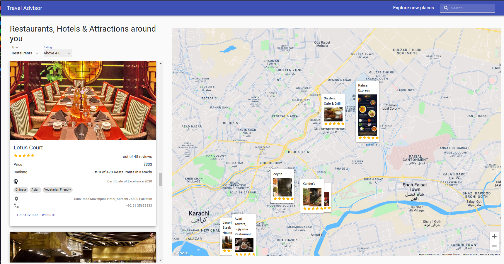
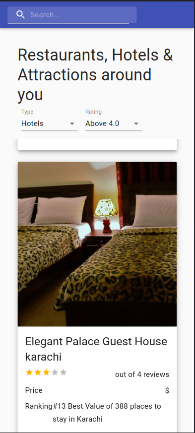

# Travel Companion Web Application

### _Travel companion app developed using React.js, RapidAPI, Material UI and Google Maps API_

### :link:

### Learned from : [JavaScript Mastery](https://youtu.be/UKdQjQX1Pko)

## Images

## Run Locally

- Run this command `git clone https://github.com/developer-junaid/Svelte-Movies-App.git`
- You are now in the dev environment and you can play around

## Technologies

- React.js
- RapidAPI
- Material-UI
- Google Maps API
